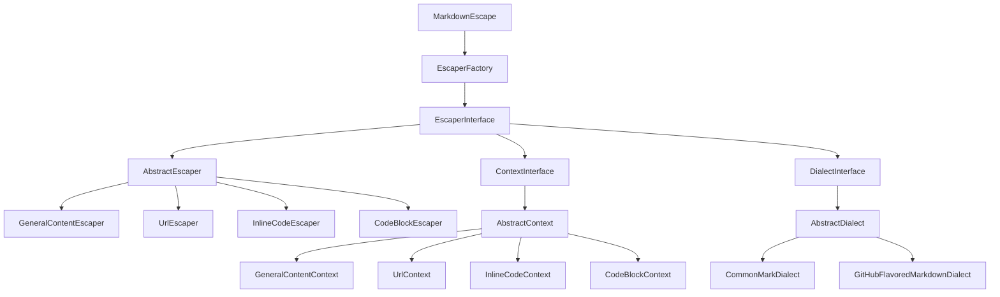
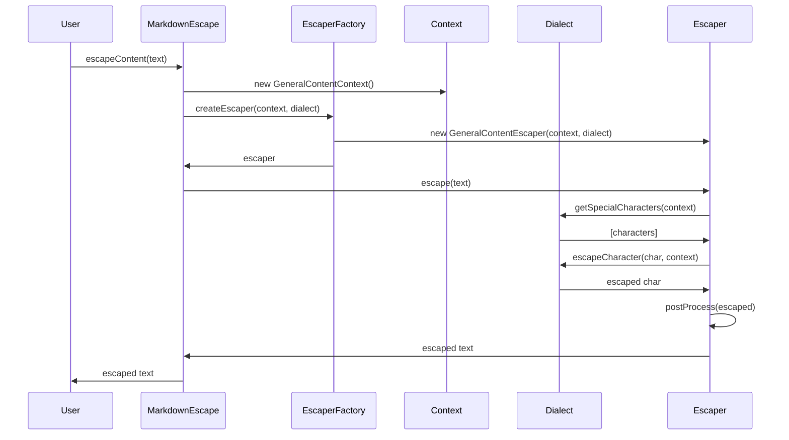

# Architecture

This document describes the architecture and design principles of the Markdown Escape PHP library.

## Overview

The library is built following SOLID principles and uses a flexible, extensible architecture that allows for easy customization and extension.



## Core Components

### 1. MarkdownEscape (Facade)

The main entry point for users. Provides a simple, fluent API for common escaping tasks.

```php
class MarkdownEscape
{
    public function escapeContent(string $content, array $options = []): string
    public function escapeUrl(string $url, array $options = []): string
    public function escapeInlineCode(string $code, array $options = []): string
    public function escapeCodeBlock(string $code, array $options = []): string
}
```

### 2. Interfaces

#### EscaperInterface

Defines the contract for all escapers:

```php
interface EscaperInterface
{
    public function escape(string $content): string;
    public function getContext(): ContextInterface;
    public function supportsDialect(DialectInterface $dialect): bool;
}
```

#### ContextInterface

Represents the context in which content is being escaped:

```php
interface ContextInterface
{
    public function getName(): string;
    public function requiresEscaping(string $type): bool;
    public function getOptions(): array;
}
```

#### DialectInterface

Represents a Markdown dialect and its escaping rules:

```php
interface DialectInterface
{
    public function getName(): string;
    public function getSpecialCharacters(ContextInterface $context): array;
    public function escapeCharacter(string $character, ContextInterface $context): string;
    public function supportsFeature(string $feature): bool;
}
```

### 3. Abstract Base Classes

#### AbstractEscaper

Provides common functionality for all escapers:

- Character-by-character escaping based on dialect rules
- Post-processing hooks for context-specific adjustments
- Dialect compatibility checking

#### AbstractContext

Base implementation for contexts:

- Name and options management
- Escaping type configuration
- Extensibility through the `configure()` method

#### AbstractDialect

Base implementation for dialects:

- Feature support tracking
- Character mapping management
- Context-aware escaping rules

### 4. Concrete Implementations

#### Escapers

- **GeneralContentEscaper**: Handles general Markdown content with special handling for start-of-line characters and word boundaries
- **UrlEscaper**: URL-specific escaping with proper encoding and Unicode support
- **InlineCodeEscaper**: Smart backtick handling for inline code spans
- **CodeBlockEscaper**: Supports both indented and fenced code blocks

#### Contexts

- **GeneralContentContext**: For text that appears in the main document body
- **UrlContext**: For URLs in links and images
- **InlineCodeContext**: For code within backticks
- **CodeBlockContext**: For multi-line code blocks

#### Dialects

- **CommonMarkDialect**: Standard CommonMark specification
- **GitHubFlavoredMarkdownDialect**: Extended GFM features

## Design Patterns

### 1. Factory Pattern

The `EscaperFactory` creates appropriate escaper instances based on context and dialect:

```php
$factory = new EscaperFactory();
$escaper = $factory->createEscaper($context, $dialect);
```

### 2. Strategy Pattern

Different escaping strategies are encapsulated in separate escaper classes, selected at runtime based on context.

### 3. Template Method Pattern

Abstract base classes define the algorithm structure, with concrete classes providing specific implementations:

```php
abstract class AbstractEscaper
{
    public function escape(string $content): string
    {
        // Common algorithm
        $escaped = $this->performEscaping($content);
        return $this->postProcess($escaped);
    }
    
    protected abstract function postProcess(string $content): string;
}
```

### 4. Facade Pattern

The `MarkdownEscape` class provides a simplified interface to the complex subsystem:

```php
$escape = new MarkdownEscape();
$result = $escape->escapeContent($text); // Hides factory, context, and escaper complexity
```

## Extension Points

### 1. Custom Contexts

Create new contexts by extending `AbstractContext`:

```php
class TableCellContext extends AbstractContext
{
    protected function configure(): void
    {
        $this->escapingTypes = ['pipe', 'newline'];
    }
}
```

### 2. Custom Dialects

Add support for new Markdown variants:

```php
class CustomDialect extends AbstractDialect
{
    protected function configure(): void
    {
        $this->features = ['custom_feature'];
        $this->characterMappings = [
            GeneralContentContext::NAME => [
                '@' => '\\@',
                '!' => '\\!'
            ]
        ];
    }
}
```

### 3. Custom Escapers

Implement specialized escaping logic:

```php
class CustomEscaper extends AbstractEscaper
{
    protected function postProcess(string $content): string
    {
        // Custom post-processing logic
        return $content;
    }
}
```

### 4. Factory Customization

Register custom escapers with the factory:

```php
$factory->registerEscaper('custom_context', 'custom_dialect', new CustomEscaper());
$factory->registerDefaultEscaperClass('custom_context', CustomEscaper::class);
```

## Data Flow



## Performance Considerations

### 1. Lazy Loading

Escapers are created on-demand and cached by the factory:

```php
if (isset($this->escapers[$contextName][$dialectName])) {
    return $this->escapers[$contextName][$dialectName];
}
```

### 2. Efficient String Operations

- Uses `str_replace()` for simple character replacements
- Regular expressions only when necessary
- Builds result strings efficiently

### 3. Minimal Dependencies

- No runtime dependencies beyond PHP itself
- Lightweight object creation
- Simple inheritance hierarchy

## Security Considerations

### 1. Input Validation

All input is treated as potentially dangerous and properly escaped according to context.

### 2. No Code Execution

The library never evaluates or executes input content.

### 3. Conservative Escaping

When in doubt, the library errs on the side of over-escaping to ensure safety.

## Testing Architecture

### Unit Tests

Test individual components in isolation:

- Context behavior
- Dialect rules
- Escaper logic
- Factory operations

### Integration Tests

Test component interactions:

- Context + Dialect + Escaper combinations
- Factory with various configurations
- Facade with different use cases

### Feature Tests

End-to-end testing of real-world scenarios:

- Complex document generation
- Edge cases and corner cases
- Performance benchmarks
